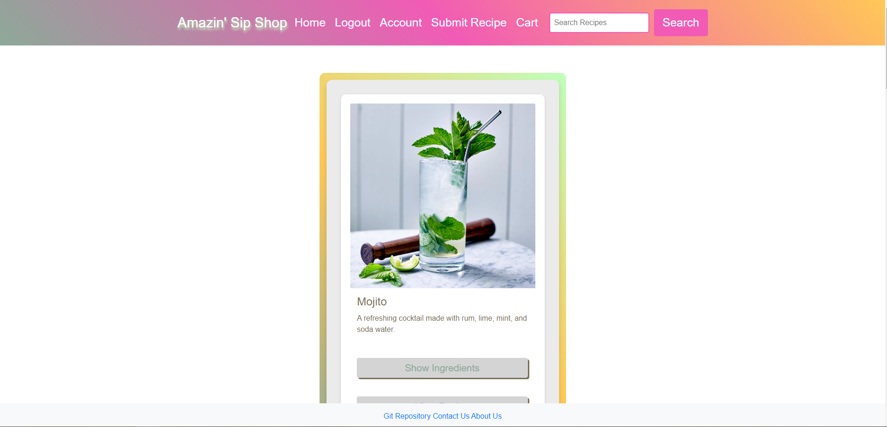
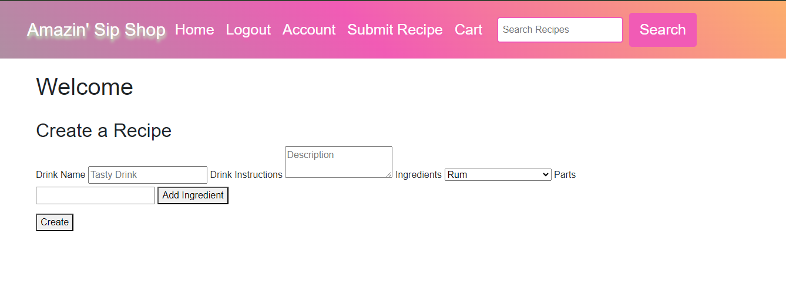
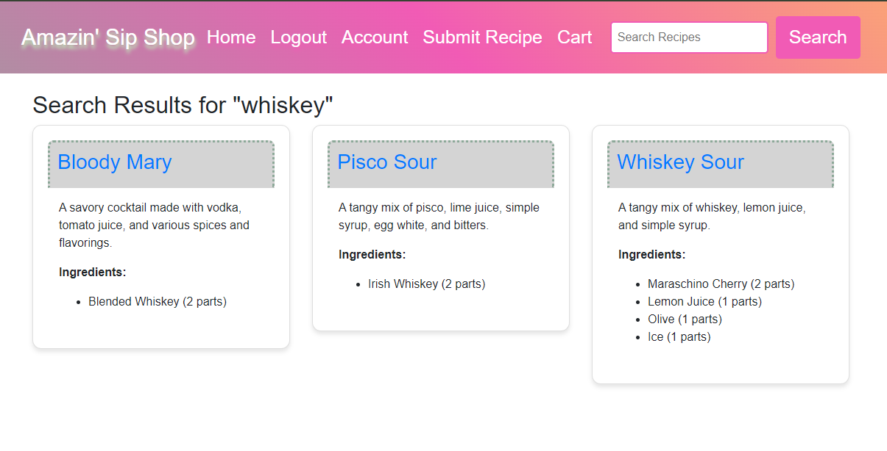
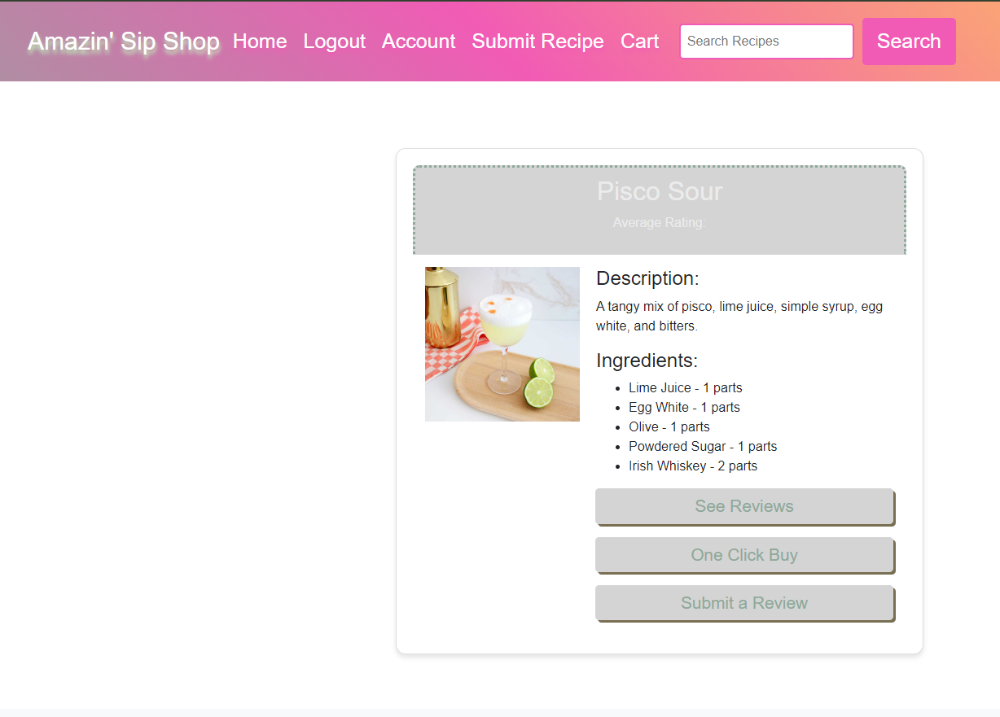

# Alcohol-Amaz-on

[](https://opensource.org/licenses/MIT)

## Description

This site is a tool for finding cocktail recipes and ordering the required ingredients. Users can add recipes to the database, leave reviews, and rate recipes. You can also view recipes that have been reviewed, along with the ratings and reviews left by others.

## Table of Contents

- [Description](#description)
- [Usage](#usage)
- [Installation](#installation)
- [Credits](#credits)
- [License](#license)

## Usage

This site has been deployed on Render.

- **Repository**: [Alcohol-Amaz-on GitHub](https://github.com/KitKatKernel/Alcohol-Amaz-on.git)
- **Render Deployment**: [Alcohol-Amaz-on on Render](https://alcohol-amaz-on.onrender.com/)






## Installation

To run this project locally:
1. Clone the repository.
2. Navigate to the project directory.
3. Install the dependencies using `npm install`.
4. Set up the PostgreSQL database.

## Usage

1. Start the PostgreSQL server.
2. Create the database and set up the schema:
    ```bash
    psql -U postgres
    \i db/schema.sql
    ```
3. Seed the database with initial data:
    ```bash
    npm run seed
    ```
4. Create an `.env` file with your PostgreSQL credentials:
    ```env
    DB_NAME=ass_db
    DB_USER=ass_db_user
    DB_PASSWORD=your_postgresql_password
    DB_URL=your_render_db_url
    ```
5. Run the application using the command:
    ```bash
    npm start
    ```

## Credits

A heartfelt thank you to my bootcamp instructors, peers, and the TOP Discord community for their continuous guidance and support. Special thanks to:

- [MDN Web Docs](https://developer.mozilla.org/en-US/) for their comprehensive resources on JavaScript and PostgreSQL.
- [Stack Overflow](https://stackoverflow.com/) for providing solutions to coding issues.
- [Node.js Documentation](https://nodejs.org/en/docs/) for detailed information on Node.js features.
- [Express.js Documentation](https://expressjs.com/en/4x/api.html) for extensive resources on Express.js.
- [Sequelize Documentation](https://sequelize.org/docs/v6/) for details on interacting with PostgreSQL using Sequelize.
- [Insomnia Documentation](https://docs.insomnia.rest/) for instructions on testing API endpoints.
- [PostgreSQL Documentation](https://www.postgresql.org/docs/) for detailed information on PostgreSQL features and SQL syntax.

## License

MIT License 

Permission is hereby granted, free of charge, to any person obtaining a copy of this software and associated documentation files (the "Software"), to deal in the Software without restriction, including without limitation the rights to use, copy, modify, merge, publish, distribute, sublicense, and/or sell copies of the Software, and to permit persons to whom the Software is furnished to do so, subject to the following conditions:

The above copyright notice and this permission notice shall be included in all copies or substantial portions of the Software.

THE SOFTWARE IS PROVIDED "AS IS", WITHOUT WARRANTY OF ANY KIND, EXPRESS OR IMPLIED, INCLUDING BUT NOT LIMITED TO THE WARRANTIES OF MERCHANTABILITY, FITNESS FOR A PARTICULAR PURPOSE AND NONINFRINGEMENT. IN NO EVENT SHALL THE AUTHORS OR COPYRIGHT HOLDERS BE LIABLE FOR ANY CLAIM, DAMAGES OR OTHER LIABILITY, WHETHER IN AN ACTION OF CONTRACT, TORT OR OTHERWISE, ARISING FROM, OUT OF OR IN CONNECTION WITH THE SOFTWARE OR THE USE OR OTHER DEALINGS IN THE SOFTWARE.
